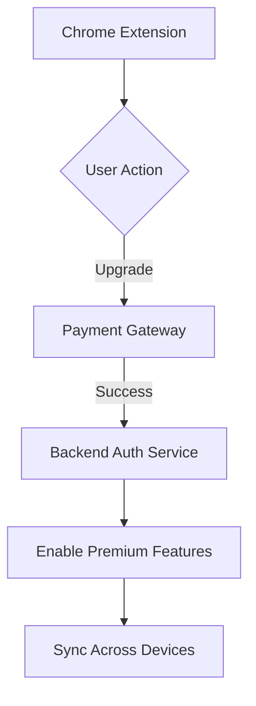

# Freemium Monetization Strategy

## Tier Structure

### Free Tier (User Acquisition)
- Basic interactive graphs (pre-built templates)
- Limited research paper analysis (3 papers/month)
- Community support
- Standard explanation depth
- Basic quiz customization

### Premium Tier ($9.99/month or $89/year)
- **Advanced Features:**
  - Unlimited research paper analysis
  - Custom graph types (3D, neural network visualizations)
  - Priority support
  - Deep explanation engine
  - Advanced quiz customization
- **Exclusive Tools:**
  - PDF annotation sync
  - Collaborative graph editing
  - Export capabilities (PNG/SVG/LaTeX)
- **Learning Analytics:**
  - Progress tracking
  - Skill gap analysis
  - Adaptive learning paths

## Technical Implementation

### Payment System Integration


1. **Chrome Web Store Payments:**
   - Add `"identity"` permission to manifest.json
   - Implement OAuth2 flow for subscription management

2. **Alternative Payment Providers:**
   - Stripe integration via iframe
   - Add Stripe.js to popup.html
   - Secure API endpoint for payment processing

### Feature Gating Architecture
1. **Entitlement Checks:**
   ```javascript
   // premium.js module
   async function checkPremiumStatus() {
     return chrome.identity.getAuthToken({interactive: false})
       .then(token => {
         // Call backend verification endpoint
       });
   }
   ```

2. **UI Modifications:**
   - Add premium badge to popup.html
   - Conditional rendering in content.js:
   ```javascript
   if (isPremiumUser) {
     showAdvancedGraphOptions();
   }
   ```

3. **Storage Strategy:**
   - Encrypted local storage for subscription status
   - Cloud sync via chrome.storage.sync

## Implementation Steps

1. **Update Manifest:**
   ```json
   {
     "permissions": [
       "identity",
       "storage"
     ],
     "oauth2": {
       "client_id": "YOUR_CLIENT_ID.apps.googleusercontent.com",
       "scopes": [
         "https://www.googleapis.com/auth/chromewebstore.readonly"
       ]
     }
   }
   ```

2. **Add Payment UI Components:**
   - Premium upgrade button in popup.html
   - Subscription management page in options.html

3. **Backend Services:**
   - Node.js server for payment processing
   - MongoDB for subscription records
   - Webhook integration for payment providers

4. **Analytics Integration:**
   - Track feature usage patterns
   - Monitor conversion funnels

## Compliance Requirements
- Clear feature tier disclosure
- GDPR-compliant data handling
- PCI DSS compliance for payment processing
- Regular security audits